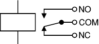

# RemoteRover
A versatile platform for remote access and support, tailored for Raspberry Pi hardware. It automates the configuration of RPi OS, network interfaces, and communication protocols (SPI/I2C/Ethernet), while supporting extensions for power management and real-time monitoring. With optional camera integration, it offers live video streaming, making it perfect for seamless remote operations.

## Prerequisites

Before using this project, ensure the following prerequisites are met:

1. **Linux or WSL (Windows Subsystem for Linux) OS available**

2. **Required Packages**
   Install the necessary packages by running the following commands:

   ```bash
   sudo apt update
   sudo apt install fdisk xz-utils sudo qemu-utils bc openssl coreutils grep sed systemd
   ```

3. **Raspberry Pi OS Image**
   Download the Raspberry Pi OS Lite image:
  - Go to the official Raspberry Pi website: [Raspberry Pi OS](https://www.raspberrypi.com/software/operating-systems/#raspberry-pi-os-32-bit)
  - Choose and download the **Raspberry Pi OS Lite** version (32-bit).

4. **Raspberry Pi board**  
   This script has been tested on the Raspberry Pi 4, but it should also work with other Raspberry Pi versions.

## Basic Usage

1. **Download the repository**  
   Clone or download the repository to your local machine.

2. **Prepare the RPi OS Image**  
   Copy the Raspberry Pi OS image into the repository folder and set the `IMGXZ` variable in the `env` file to the full image file name.

3. **Configure system details**  
   In the `env` file:
   - Set `RASPIHOST`, `USERNAME`, and `USERPASS` to define the host name, user, and password.

4. **Network settings**  
   In the `env` file:
   - **Ethernet (static IP):** Set `RUN_ETH=1`, `NETIP`, `NETMASK`, and `NETGW` for static IP configuration.
   - **WLAN:** Set `RUN_WLAN_DHCP=1` for DHCP or `RUN_WLAN=1` for a static IP. Specify `SSID` (Wi-Fi name), `PSK` (password), and static IP details (`WLAN_NETIP`, `WLAN_NETMASK`, `WLAN_NETGW`) if using static addresses.
  Please note that a network connection is required for the proper setup of the RPi OS image, so ensure that the network settings are correctly configured as described above.


5. **Enable features for the image**  
   Set the necessary `RUN_*` variables to 1 in the `env` file to enable specific features, for example: `RUN_I2C` for I2C communication support or `RUN_CAMERA`  to have a live view with Raspberry Pi Camera ( see details below). 

6. **Generate the image**  
   Run the following command to generate the custom Raspberry Pi OS image:

   ```bash
   sudo ./remoterover.sh
   ```

7. **Write the generated image to an SD Card**
   - Download and use the [Raspberry Pi Imager](https://www.raspberrypi.com/software/) to write the generated image to an SD card.
   - Select "Use custom" when choosing the image to write, and select the generated image.

8. **Plug and play (or pray :) )**  
   - During startup, all required packages and features will be installed and configured.
   - Check if your tools have been installed properly by running:
   ```bash
   ls ~/localrover.sh
   ```
   If the file exists, it means the setup did not execute correctly, and you will need to run it manually. Refer to the Troubleshooting section for details. 


## Feature Usage

### I2C communication feature
**Description:**  
This feature provides I2C communication with external devices as a master. The Raspberry Pi acts as the master and communicates with I2C slave devices.

**Hardware:**  
No specific hardware is required.
Connect to I2C slave devices using the following GPIO pins (as per [Raspberry Pi Pinout](https://pinout.xyz/pinout/i2c)): **GPIO 2 (SDA)** for Data and **GPIO 3 (SCL)** for Clock.

**Usage:**  
To scan/write and read from external I2C devices, use:  
```bash
  # Scan: 
  i2cdetect -y 1
  # Write:
  i2cset -y 1 <device_address> <register> <data>
  # Read: 
  i2cget -y 1 <device_address> <register>
```

### SPI communication feature
**Description:**  
This feature provides SPI communication with external devices as a master. The Raspberry Pi communicates with SPI slave devices.

**Hardware:**  
No specific hardware is required.
Connect to SPI slave devices using the SPI0 or SPI1 pins (as per [Raspberry Pi Pinout](https://pinout.xyz/pinout/spi)).

**Usage:**  
To exchange data on a specific SPI device using `spi-pipe`, use:  
```bash
  echo -n "data" | spi-pipe --spi /dev/spidev0.0
```

For more information on `spi-pipe` refer to [this page](https://manpages.debian.org/testing/spi-tools/spi-pipe.1.en.html)

### UART communication feature
**Description:**  
This feature provides UART communication between the Raspberry Pi and external serial devices. UART is commonly used for serial data transmission between the Pi and peripherals such as GPS modules, sensors, or other microcontrollers.

**Hardware:**  
Connect to UART-compatible devices using the following GPIO pins (as per [Raspberry Pi Pinout](https://pinout.xyz/pinout/uart)):  
- **GPIO 14 (TXD)** for Transmit  
- **GPIO 15 (RXD)** for Receive  

Ensure the voltage levels of the UART device match those of the Raspberry Pi (3.3V logic levels).

**Usage:**  
To communicate with a serial device via UART, you can use `minicom`.  

Start minicom with the correct serial port (/dev/serial0 or /dev/AMA0 depending on Raspberry Pi model):
```bash
   sudo minicom -b 9600 -o -D /dev/serial0
```
- -b 9600 sets the baud rate to 9600 (adjust as needed).
- -D /dev/serial0 specifies the UART device.

For more advanced options, refer to the Minicom manpage.

### STM32 GDB Server feature
**Description:**  
This feature allows remote debugging of STM32 microcontrollers using a GDB server. It is commonly used to debug firmware on STM32 devices from an IDE like STM32CubeIDE through a remote setup.

**Hardware:**  
An STM32 development board with ST-LINK debugger, and network access to the Raspberry Pi running the GDB server.

**Usage:**  

#### Debugging

1. Open STM32CubeIDE and navigate to **Run > Debug Configurations**.

2. Create a new GDB Hardware Debugging configuration by right-clicking on **GDB Hardware Debugging** and selecting **New Configuration**.

3. In the **Debugger** tab, configure the following:
    * Set **GDB Command** to `arm-none-eabi-gdb`.
    * Check the **Remote Target** box.
    * Select **ST-LINK (ST-LINK GDB Server)** for the **JTAG Device**.
    * Enter the Host IP and port (default port: 4242) of the GDB server running on the Raspberry Pi.

4. Click **Apply**, then click the **Debug** button. Once debugging starts, you can immediately close the session if you only wanted to apply the configuration.

5. To begin debugging later, use the drop-down next to the debug button and select the new configuration.

#### UART/Serial

To access the UART interface through STM32CubeIDE:

1. While in the **Debug** perspective, open the console tab and select **Open Console > Command Shell Console**.

2. In the **Select Remote Configuration** window, choose **Telnet** as the connection type, with UTF-8 encoding.

3. Enter the host IP of the Raspberry Pi and port 8686 to connect to the UART interface.

4. Confirm the connection, and you should see a message in the console indicating the successful connection to the UART.

To disconnect, use the red **N** button in the console window.

Alternatively, use a terminal:
```bash
   telnet myraspberrypihostname.local 8686
```

This connects directly to the Raspberry Pi on port 8686. You should see serial connection details and can now interact with the UART interface on the STM32 device.

For more information please refer to [this page](https://github.com/eosti/remote-stm32/blob/master/client.md?plain=1)

### Pi Camera streaming feature
**Description:**  
This feature streams video from the Raspberry Pi Camera Module over the network. The stream can be accessed using any browser or media player capable of handling network streams.

**Hardware:**  
A Raspberry Pi with an attached Camera Module v2.

**Usage:**  
The video stream is provided using **camera streamer** and can be accessed via the following URL:  

https://myraspberrypihostname.local:8080/stream

To start or configure the stream, use the `camera streamer` tool on your Raspberry Pi. 

If additional configuration or troubleshooting is needed, check the `camera streamer` documentation or modify the server settings to adjust resolution, frame rate, or other stream parameters.

### Power Monitor HAT feature
**Description:**  
This feature allows monitoring of power consumption using the Power Monitor HAT from SB Components. The HAT uses INA219 sensors to measure voltage, current, and power on up to three different channels.

**Hardware:**  
[Power Monitor HAT from SB Components.](https://shop.sb-components.co.uk/collections/raspberry-pi-new-release/products/power-monitoring-hat)

**Usage:**  
To monitor power on the INA219 channels, use the provided Bash script as follows:

- **Monitor a specific channel**:  
Run the script with the desired channel (CH1, CH2, or CH3) to display power data for that channel:
```bash
   power_monitor CH1
```
- **Monitor all channels**:  
If no argument is provided, the script will display data for all available channels:
```bash
   power_monitor
```
- **Help**:  
To view the usage instructions:
```bash
   power_monitor -h
```

For more information please refer to [this page](https://github.com/sbcshop/Power-Monitor-HAT)

### Waveshare Raspberry Pi Relay Board feature
**Description:**  
This feature controls relays on the Waveshare Relay Board connected to the Raspberry Pi. The relays can be switched on or off, allowing for control of external devices.

**Hardware:**  
Waveshare Raspberry Pi Relay Board.

**Usage:**  
To control the relays, use the provided Bash script as follows:

- **Turn on a relay**:  
  Specify the channel (CH1, CH2, or CH3) and set the state to `ON`:
```bash
  set_relay CH1 ON
```
- **Turn off a relay**:  
Specify the channel and set the state to OFF:
```bash
  set_relay CH1 OFF
```
- **Help**:  
To display usage instructions:
```bash
  set_relay -h
```

**Relay Contacts**:



- NO (Normally Open):  
The contact is open when the relay is off and closes when the relay is on.
- NC (Normally Closed):  
The contact is closed when the relay is off and opens when the relay is on.

For more information please refer to [this page](https://www.waveshare.com/wiki/RPi_Relay_Board)

### SEEED STUDIOS CAN-BUS (FD) HAT for Raspberry Pi
**Description:**  
A CAN BUS shield for Raspberry Pi, it has 2 channel CAN BUS I/O, supports CAN FD for much faster transmission speed(up to 8Mbps).

Also it has two On-board 120Ω terminating resistors which are controlled by the switches.

**Hardware:**  
SEEED STUDIOS CAN-BUS (FD) HAT for Raspberry Pi

**Usage:**  
Set the can fd protocol, and the dbitrate can be set to 8M speed (default setting below, you can change it to your own liking).

```bash
sudo ip link set can0 up type can bitrate 1000000   dbitrate 8000000 restart-ms 1000 berr-reporting on fd on
sudo ip link set can1 up type can bitrate 1000000   dbitrate 8000000 restart-ms 1000 berr-reporting on fd on

sudo ifconfig can0 txqueuelen 65536
sudo ifconfig can1 txqueuelen 65536
```

**Testing connection:**

Open two terminal windows and enter the following commands in each window to test can fd protocol.
```bash
#send data
cangen can0 -mv 

#dump data
candump can0
```

You can test the CAN-BUS by connecting two channels by itself using jumpers: 0_L <===> 1_L, 0_H <===> 1_H.

For more information please refer to [this page](https://wiki.seeedstudio.com/2-Channel-CAN-BUS-FD-Shield-for-Raspberry-Pi/?spm=a2g0o.detail.1000023.1.7de7Ql56Ql56Tw)

## Troubleshooting
During the startup of the RPi OS, the script may fail. If this happens, the files required for setup will not be deleted from the system. After fixing the issue, you can run the setup manually using the appropriate command.
   ```bash
   ~/localrover.sh
   ```

### Known reasons for failure:
- Lack of Internet access
- Interruption during the startup phase
